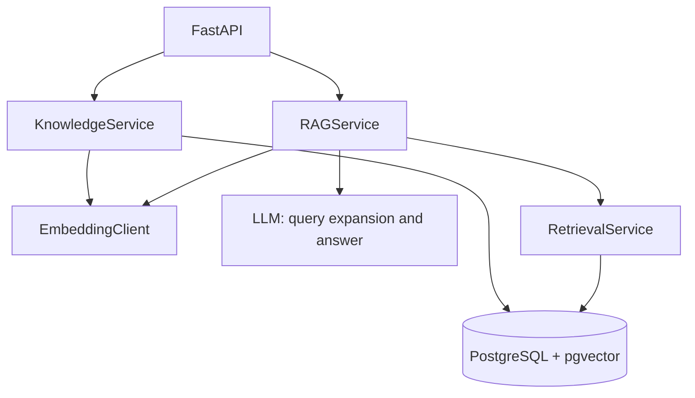

# Graph RAG Demo

一个本地 Graph RAG 演示项目。当前阶段提供可复现的“向量检索 + 中文全文检索 + 查询扩写 + 一次全局 RRF”链路；后续可在此基础上加入实体抽取、实体搜索与图检索。

## 核心能力

| 概念 | 本项目中的位置 |
| --- | --- |
| 中文递归 Token 分块 | `chunking.py`、`services/knowledge.py` |
| 原子入库 | `services/knowledge.py` 的“先全部 Embedding，后单事务写库” |
| 混合检索 | `services/retrieval.py` 的 pgvector 与 PostgreSQL FTS |
| 查询扩写 | `services/rag.py`，业务自行构造消息并保留原问题、最多三条变体 |
| 结果融合 | 所有查询和检索渠道完成后只执行一次全局加权 RRF |



本阶段刻意不包含意图识别、业务分类过滤、Neo4j、实体/关系表、重试、后台任务或 DI 框架。它们会作为可独立对比的后续实验，而不是混入基线。

`api/app.py` 只创建应用、管理生命周期并组装服务；`api/routes.py` 只注册 HTTP 端点。请求/响应模型位于 `models/api.py`，外部模型调用位于 `clients/`，业务编排位于 `services/`。

`LLMClient.complete(messages)` 是通用模型调用边界，不固定问题和上下文的模板。扩写和回答的 system/user 提示词由 `services/prompts.py` 构造；模型 JSON 使用 `models/generation.py` 的 Pydantic 模型校验，RAG 业务规则仍由 `services/rag.py` 负责。

## 快速开始

需要 Docker、Python 3.11+ 与 [uv](https://docs.astral.sh/uv/)。

```bash
docker compose up -d
uv sync --group dev
cp .env.example .env
```

仅验证本地数据库健康状态时，可保持 `USE_REAL_CLIENTS=false`。要上传文档或问答，请在 `.env` 中设置：

```dotenv
USE_REAL_CLIENTS=true
DASHSCOPE_API_KEY=your-local-key
```

真实密钥只存在于被 Git 忽略的 `.env`。加载配置后启动服务：

```bash
set -a; source .env; set +a
uv run python scripts/run_server.py
```

服务只暴露三个端点：

```bash
curl http://127.0.0.1:8000/health

curl -X POST http://127.0.0.1:8000/documents \
  -H 'content-type: application/json' \
  -d '{"title":"Graph RAG","content":"Graph RAG uses entities and relations."}'

curl -X POST http://127.0.0.1:8000/ask \
  -H 'content-type: application/json' \
  -d '{"question":"What does Graph RAG use?"}'
```

成功时，`/documents` 返回 `{"document_id": 1}`；`/ask` 返回模型答案及实际进入上下文的 `used_chunk_ids`。重复清洗后正文返回 `409`。空白 `content` 或 `question` 返回 FastAPI 的 `422` 校验错误。模型未配置或暂时不可用时，端点返回不含密钥和底层错误详情的 `503`。

## 本地数据与测试

Compose 首次启动会执行 `scripts/init_db.sql`，建立 `kb_document` 和 `kb_chunk`，并启用 pgvector。文本优先按段落、换行和中文标点递归分块，`token_count` 使用 `tiktoken` 的 `cl100k_base` 编码；它是统一、可复现的分块与上下文估算口径，不等同于 Qwen 的精确计费 token。

```bash
uv run python -m pytest tests/unit -v
RUN_INTEGRATION_TESTS=1 uv run python -m pytest tests/integration -v
```

单元测试使用注入的 Fake 客户端，不访问模型服务。集成测试只使用 Docker Compose 的真实 PostgreSQL + pgvector 和确定性 Embedding Fake，因此不会产生外部模型费用。

## 检索观测日志

项目使用 Python 标准 logging 记录 RAG 关键阶段。日志默认遵循应用的 logging 配置：

- INFO：扩写开始/完成或回退、检索完成数量、RRF 开始/完成数量、回答完成引用数量。
- DEBUG：每条向量结果的 similarity 和 distance、每条全文结果的 score、每条最终 RRF 结果的 score。

向量距离越小越接近；全文检索分数越高越匹配；RRF 分数越高最终排序越靠前。日志只记录 chunk ID、rank、数量和分数，不记录完整文档正文、提示词、答案或密钥。

向量检索显式计算 pgvector 的余弦相似度，默认只保留 similarity 大于 0.6 的结果。距离仅作为观测日志中的派生值，阈值由 VECTOR_MIN_SIMILARITY 配置。

## 设计原则

- 所有配置来自环境变量，源码不保存远程地址或密钥。
- 数据库、HTTP 客户端和服务生命周期均为异步；应用通过 FastAPI lifespan 管理资源。
- 文档和所有 chunk 在同一事务中写入；Embedding 失败时不会开始数据库写入。
- 查询扩写、向量检索和全文检索的所有排名列表只做一次全局 RRF，结果保留来源信息。
- 不包含意图识别、业务类别和分类过滤。

## 下一步：实体与图检索

后续实体抽取应将每个实体和关系绑定到稳定的 `kb_chunk.id`。实体搜索可以作为新的候选来源参与现有全局 RRF；Neo4j 则仅负责关系扩展和多跳查询，不能替代 PostgreSQL 保存原文和当前 RAG 基线。
