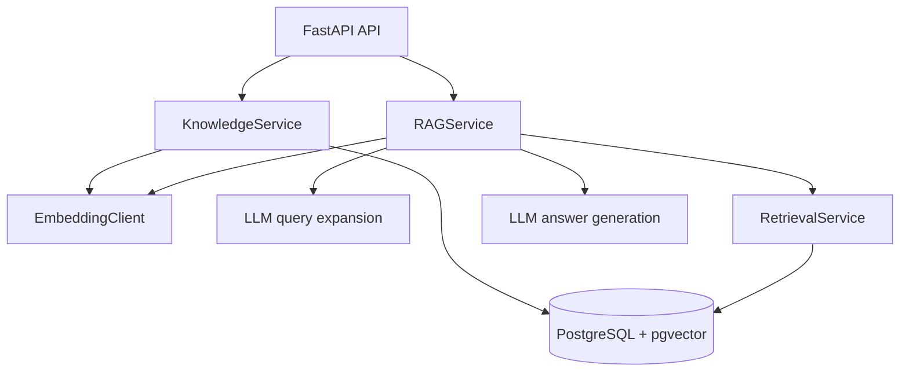
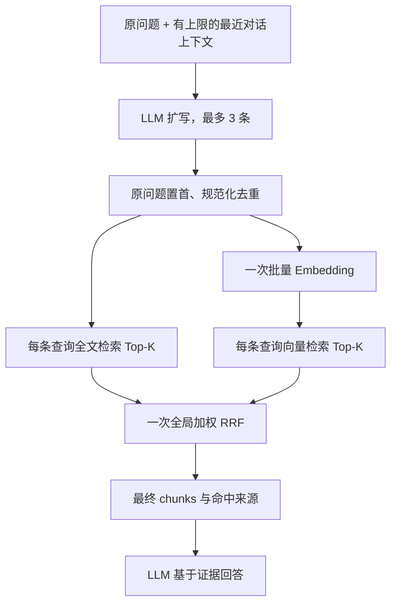

# Graph RAG Demo 基础阶段设计

## 1. 目标与范围

本项目是一个本地 Graph RAG 演示项目。基础阶段的目标是建立一条严谨、可复现的传统 RAG 基线，为下一阶段的实体抽取、实体搜索和图检索提供可对比的入口。

本阶段保留 PostgreSQL、pgvector、中文全文检索、查询扩写和 RRF 融合；删除现有项目中的意图识别、业务分类及按业务类别过滤。

本阶段不实现 Neo4j、实体表、关系表、图遍历、后台任务、文件解析、多租户、鉴权、管理后台或通用插件/DI 框架。

## 2. 运行边界

- 新项目目录：`/Users/taven/WorkSpace/mine/graph-rag-demo`
- Git：独立仓库。
- 环境：完全本地化。Docker Compose 只启动 PostgreSQL + pgvector。
- 密钥：真实 DashScope Key 仅放在本地 `.env`；仓库只提供 `.env.example`。
- 外部模型：仅在手动真实演示时调用。自动测试使用 Fake 客户端，不访问外网且不产生模型费用。

## 3. 架构



代码按职责组织，不增加通用 Repository 或抽象基类：

```text
src/graph_rag_demo/
  api/
    app.py               FastAPI 创建、生命周期和服务组装
    routes.py            三个 HTTP 端点的注册与请求处理
  clients/
    embedding.py         DashScope Embedding HTTP 客户端
    llm.py               DashScope LLM HTTP 客户端和 Prompt
  models/
    api.py               请求、响应和应用服务模型
    chunk.py             TokenChunk
    generation.py        问答结果模型
    retrieval.py         检索结果模型
  services/
    knowledge.py         清洗、token 分块、Embedding、原子入库
    retrieval.py         向量/全文检索与全局 RRF
    rag.py               扩写、检索、上下文、回答编排
  config.py              环境变量与启动校验
  db.py                  异步 PostgreSQL 连接与事务
  text.py                共享文本清洗
  chunking.py            Token 分块
  tokenize_fts.py        中文全文检索分词
```

应用使用 FastAPI 生命周期创建和关闭共享资源；服务依赖通过构造函数传入，方便替换 Fake，不使用可变全局单例。HTTP 与数据库调用均采用异步实现。

## 4. 数据模型与入库

仅保留两张表。

`kb_document`：`id`、`title`、清洗后正文的 SHA-256 `checksum`、可选 `metadata`、`created_at`。

`kb_chunk`：`id`、`document_id`、`chunk_index`、`content`、`token_count`、`content_tsv`、1024 维 `embedding`、可选 `metadata`、`created_at`。`(document_id, chunk_index)` 唯一。

`token_count` 是实际分块 token 数，不再以字符数冒充 token 数。使用 `tiktoken` 的固定编码，作为该项目分块、重叠和上下文预算的统一、可复现估算口径；README 明确说明它不等同于 Qwen 的精确计费 token。

分块流程：清洗文本 -> Tokenizer 编码 -> 每块 `CHUNK_SIZE` tokens -> 相邻块保留 `CHUNK_OVERLAP` tokens -> 解码为文本 -> 记录实际 `token_count`。

入库流程：

```text
清洗 -> token 分块 -> 批量生成全部 Embedding
                              | 失败：不写数据库
                              v
单个数据库事务：写 document -> 批量写 chunks -> 提交
                              | 失败：全部回滚
```

数据库唯一约束处理并发重复上传；重复正文返回明确业务错误。Embedding 维度固定为当前 `text-embedding-v4` 的 1024，启动时校验配置，切换维度必须伴随显式 schema migration。

## 5. 查询扩写与检索

查询扩写保留，是独立于意图识别的召回能力。



- 原问题始终存在并置首；扩写最多三条。
- 扩写与原问题规范化后去重。空扩写也继续用原问题检索。
- 全部查询由一次批量 Embedding 请求处理。
- 每个查询的向量结果和全文结果都是独立、有序的排名列表。
- 所有列表在结果齐备后只做一次全局加权 RRF，不进行按查询的中间融合。原问题对应列表的权重高于扩写列表。
- `SearchResult` 保留 `chunk_id`、内容、最终 RRF 分数和最小命中记录（查询来源、检索渠道、排名），便于展示检索过程，也为后续实体/图检索接入提供统一候选格式。
- 上下文只使用最终排名靠前且未超出 token 预算的 chunks。

## 6. API 与错误语义

- `GET /health`：确认应用和本地 PostgreSQL 可连接。
- `POST /documents`：上传纯文本，完成 token 分块、向量化和原子入库。
- `POST /ask`：接收问题和可选对话上下文，返回 `answer` 与 `used_chunk_ids`。

扩写超时、HTTP 异常或 JSON 格式异常时，记录原因并降级为只检索原问题。Embedding、数据库检索和最终回答生成失败则返回明确服务错误。

第一阶段不做自动重试：外部模型重试会增加成本、时延和实验变量。需要时将“可重试错误和重试代价”作为独立研究项设计。

最终回答中的 `used_chunk_ids` 必须是实际进入上下文的 chunk；模型返回的其他 ID 被过滤。

## 7. 测试与验证

单元测试使用 Fake/Mock，覆盖：

- token 分块、token 重叠和实际 `token_count`；
- 配置与密钥缺失的启动校验；
- RRF 的一次性全局融合、原问题权重、去重与多路命中累计；
- 空/重复/失败扩写时的原问题降级；
- 引用 ID 校验；
- LLM/Embedding HTTP 异常。

集成测试针对 Docker Compose 启动的真实 PostgreSQL + pgvector，覆盖建表、真实写入、向量检索、全文检索、事务回滚和重复文档约束。模型客户端使用确定性 Fake。

README 必须包含：核心能力、架构图、快速开始、本地环境、成功与失败示例、测试命令、设计原则，以及下一阶段实体与图检索的接入点。

## 8. 后续阶段边界

下一阶段从稳定的 `kb_chunk.id` 回溯证据，新增受控实体类型/关系类型、实体抽取与实体搜索。图数据库成为关系扩展层，而不替代 PostgreSQL 保存文档、片段和当前向量检索基线。
